# Day3_hw1

> **광운대학교 컴퓨터정보공학부**  
> **작성자:** 장경민  
> **제출일:** 2026.09.17.

---

## 1. 개요 (Overview)
Lifecycle 노드를 이용해 가상의 센서 데이터 생성 노드(fake_imu)와 데이터 감시자(imu_watchdog)를 만드는 프로그램 이다.

## 2. 체크포인트 (checkpoint)

### 2.1 fake_imu: 상태별로 ros2 topic hz /imu 확인
 
Inactive
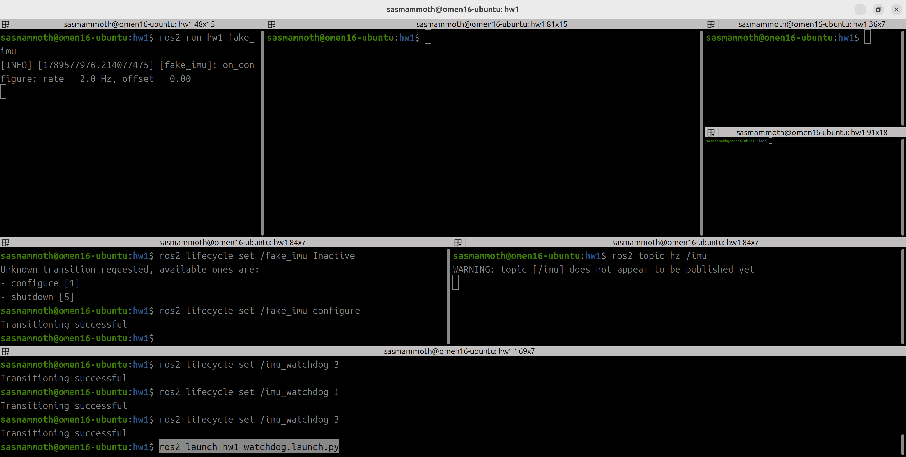

Active
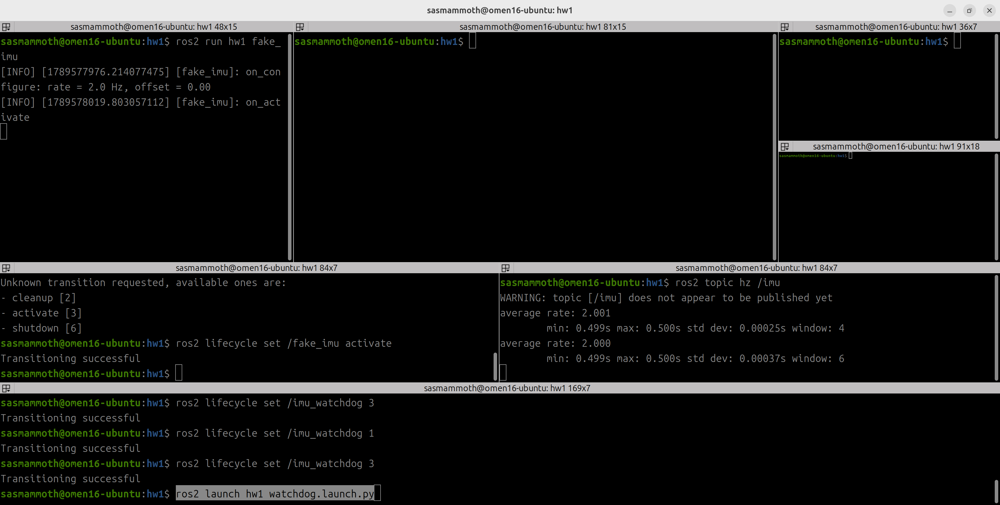

Finalized
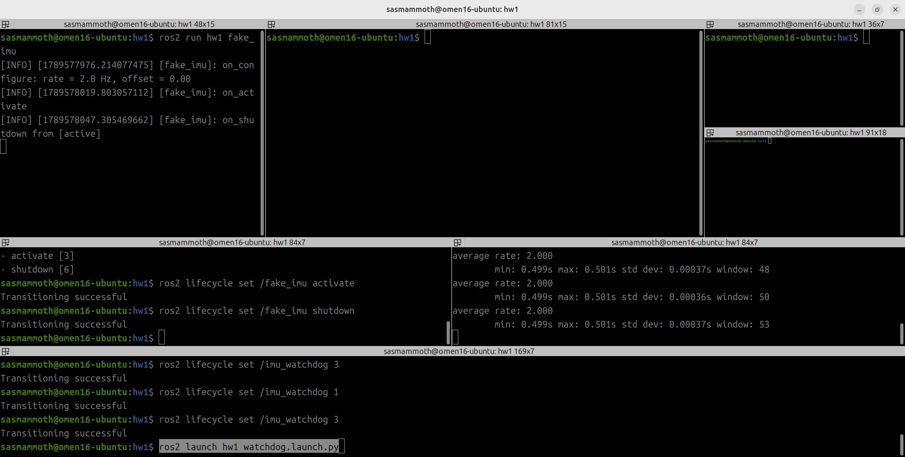

Unconfigured
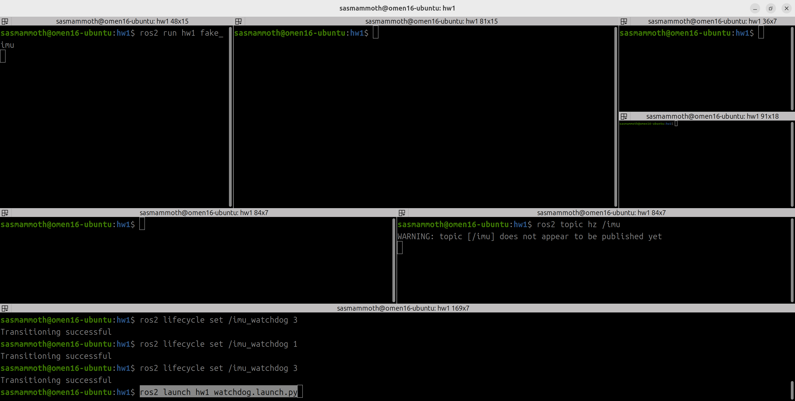

### 2.2 워치독 뼈대: 전이 로그, 파라미터 FAILURE 확인

전이 로그
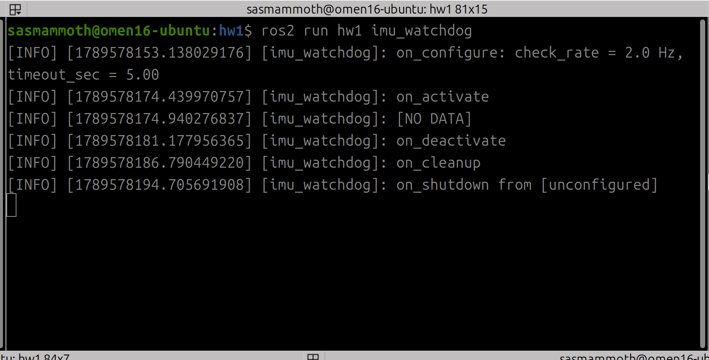

파라미터 FAILURE 
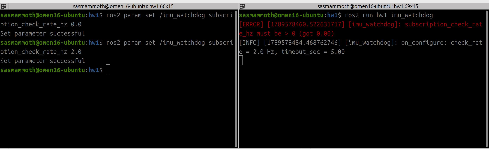
imu_watchdog의 구독갱신주기(subscriprion_check_rate_hz) 를 0으로 설정한 모습. 자동으로 Unconfigured로 튕겨나간다.

### 2.3 실제 시간에서 두 노드 연동
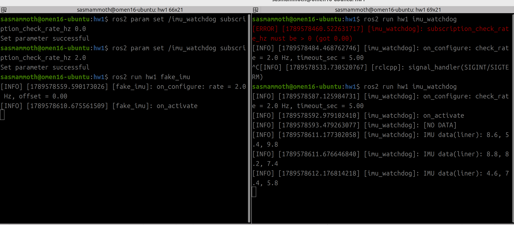
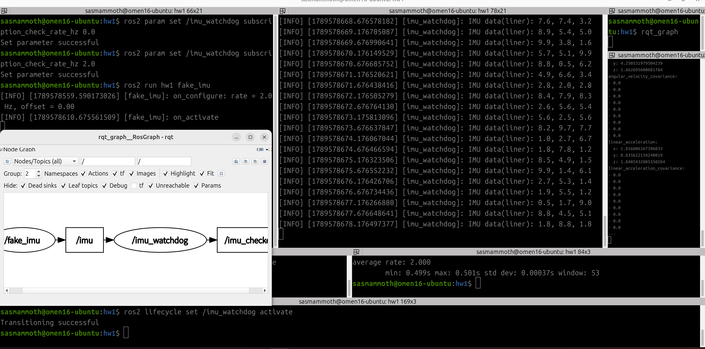
실시간 출력, rqt_graph, 정제된 값 출력등이 있다.

### 2.4 fake_imu deactivate / offset으로 고장 재현
deactivate로 고장
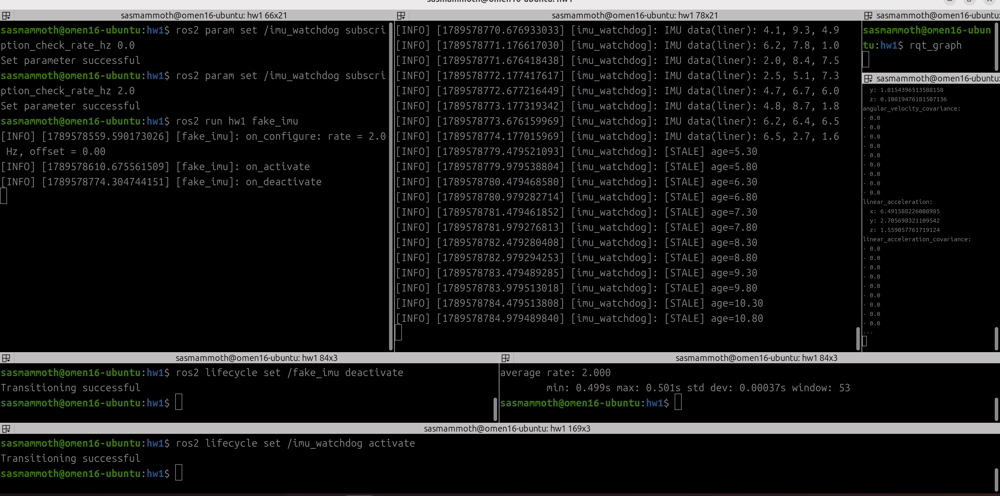

offset으로 고장 (지연 데이터) (6s)
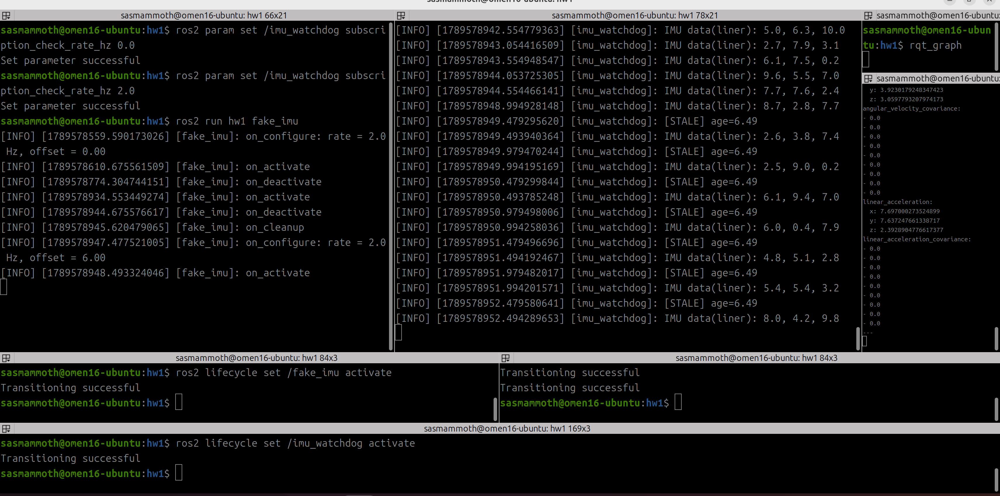
잘 보이진 않지만, 토픽 에코(ros2 topic echo /imu_checked)(최우측 가운데)를 이용해 신선한 데이터를 받아오는데, 이것이 멈췄다.

### 2.5 고장을 넣으며 ros2 bag record /imu로 공백 bag 녹화
rosbag2_2026_09_17-02_40_37 로 저장됨.10여초간 정상 출력 -> 10여초간 deactivate -> 다시 10여초간 정상 출력 등으로 구성되어있다.

### 2.6 워치독만 sim time으로 켜고 ros2 bag play --clock 재생, 일시정지·2배속 확인

[STALE] 상태에서 일시정지 하면 모든게 멈춤(age가 안 늘어남 + [STALE]이 추가가 안 됨. 다시 재개 하면 age가 아까 걸 그대로 이어서 감.)
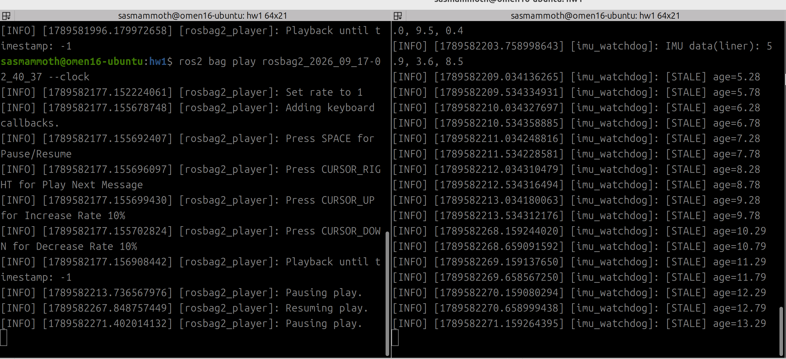

2배속 하면 전체 시간이 2배속으로 흐름
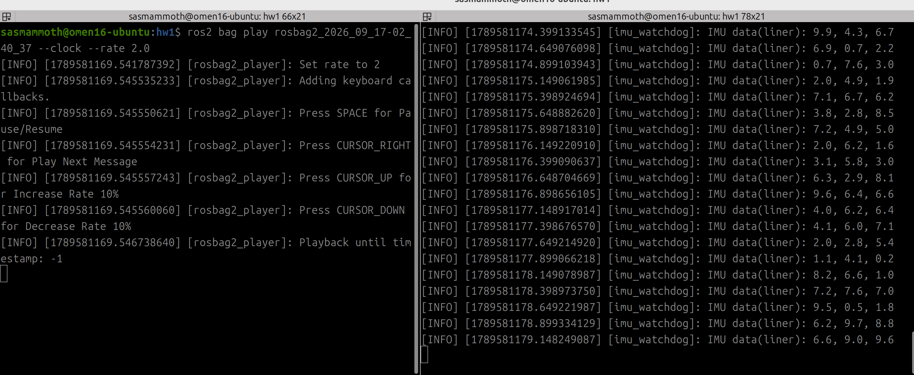

### 2.7 워치독만 wall timer로 바꿔 일시정지 결과 비교
[STALE] 상태에서 일시정지 하면 age는 안 늘어나지만, [STALE] 는 계속 추가됨 = 안에서 프로그램이 돌 고 있음.
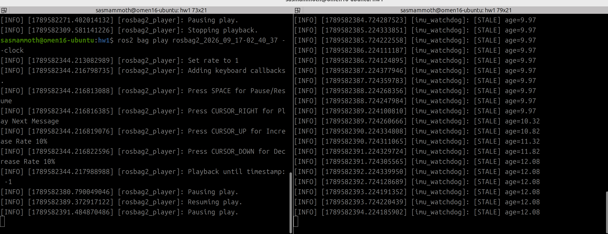

### 2.8 launch 실행 
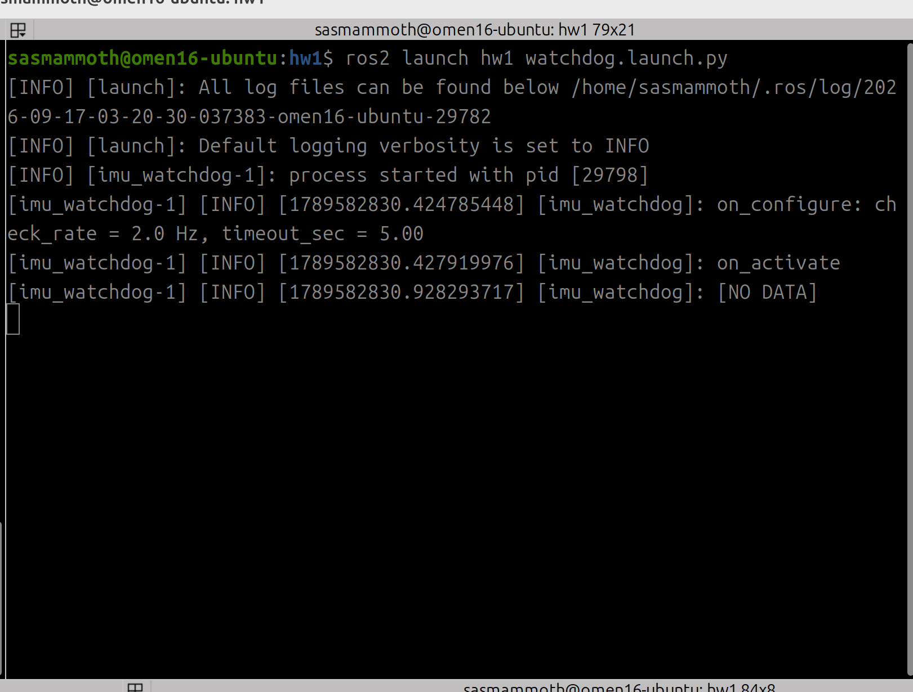 

## 3. 추가적인 설명

강의자료에 있는 lifecycle_talker.cpp를 헤더파일과 소스파일로 분리하였다. 분리한 파일을 이용해 fake_imu를 만들었고, 퍼블리셔를 imu형식으로 바꾸고 랜덤 난수를 발행하도록 바꾸었다. fake_imu에서 deactivate와 stamp = now() − stamp_offset_sec 등을 이용해서 데이터 지연을 구현하였다. imu_watchdog 또한 lifecycle_talker를 이용항 구현 하였다. timeout_sec와 현재시간 등을 이용해 구독자가 불릴때 발행시각/현재시각 차를 이용해 신선한 데이터만 /imu_checked로 발행하도록 하였다.