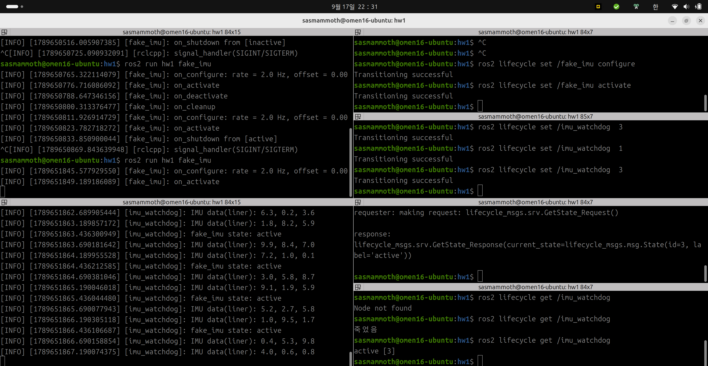
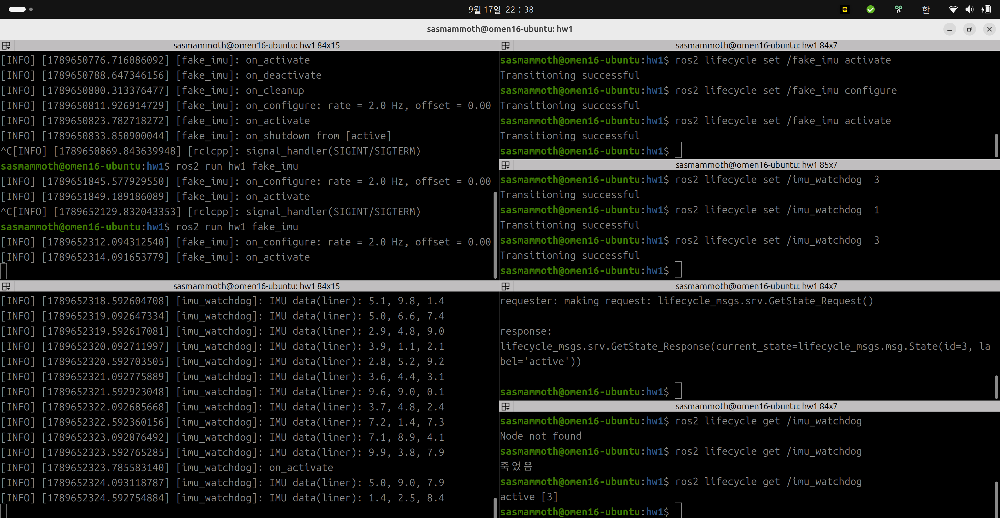

# Day4_hw1

> **광운대학교 컴퓨터정보공학부**  
> **작성자:** 장경민  
> **제출일:** 2026.09.18.

---

## 1. 개요 (Overview)
1일차 imu_watchdog에 “1초마다 /fake_imu/get_state로 센서 노드 상태를 물어 로그로 출력하는” 기능을 추가한 프로그램이다.

## 2. 체크포인트 (checkpoint)

모든 영상은 /etc폴더 안에 저장되어 있음.

### 2.1 일부러 틀리기
``` cpp
// 응답 생성 
auto request = std::make_shared<lifecycle_msgs::srv::GetState::Request>();

//클라이언트 요청 보내기
auto future = imu_state_client_->async_send_request(request);
auto response = future.get();
RCLCPP_INFO(get_logger(), "fake_imu state: %s",
        response->current_state.label.c_str());

```
위와 같이 코드를 작성하여 타이머 콜백 안에서 응답을 기다리는 방식으로 구현하였다. `imu_watchdog` 이 active로 올라가면 서비스 응답을 대기하느라 `IMU data(liner)` 출력이 멈춘다. (데드락 상태가 된다.) 여기서 `/fake_imu/get_state` 를 통해 상태를 보면 active 상태이고, `ros2 lifecycle get /imu_watchdog` 는 응답이 없다.

### 2.2 Ch2.1 해결
```
// 응답 생성
auto request = std::make_shared<lifecycle_msgs::srv::GetState::Request>();

// 비동기 요청 + 응답 콜백
// 람다식을 이용해 응답을 기다린다.
imu_state_client_->async_send_request(
    request,
    [this](rclcpp::Client<lifecycle_msgs::srv::GetState>::SharedFuture future)
    {
        auto response = future.get();
        RCLCPP_INFO(get_logger(), "fake_imu state: %s",
                    response->current_state.label.c_str());
    });
```

서비스응답이 오면 람다식을 실행하도록 함. 따라서 요청과 응답을 나누어서 타이머 콜백이 실행 흐름을 붙잡고 있지 않게 함. 따라서 계속 `IMU data(liner)` 출력과 `fake_imu state:` 를 제대로 출력함.

### 2.3 상태 따라가기
과제에 나와있는 대로 configure -> activate -> deactivate -> cleanup -> configure -> activate -> shutdown 상태를 바꾸니 imu_watchdog에서 알 맞은 상태가 나왔음.

### 2.4 callback group + MultiThreadedExecutor 로 해결하기

count_callback()의 코드를 2.1의 코드로 바꾼뒤 콜백 그룹에 imu_state_client_ 를 추가하고 main에 멀티스래드 실행을 추가하였다. 위의 사진과 같이 정상적으로 출력되는 모습이다.


count_collback()의 코드를 2.1의 코드로 바꾼뒤 콜백 그룹을 따로 설정하지 않고 main에 멀티스래드 실행을 추가하였다. 위의 사진과 같이 2.1과 같이 노드가 멈추는 모습이다.